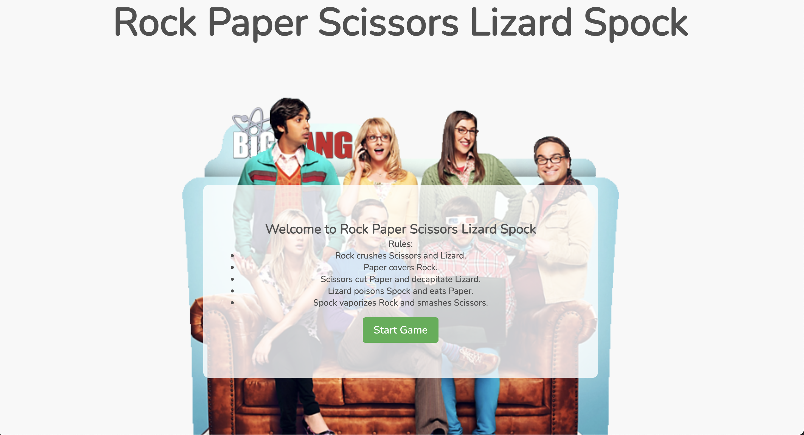
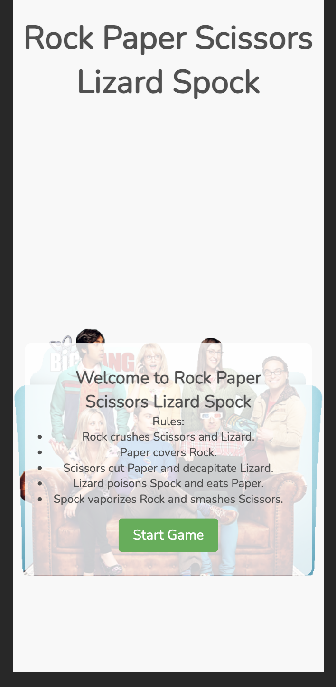
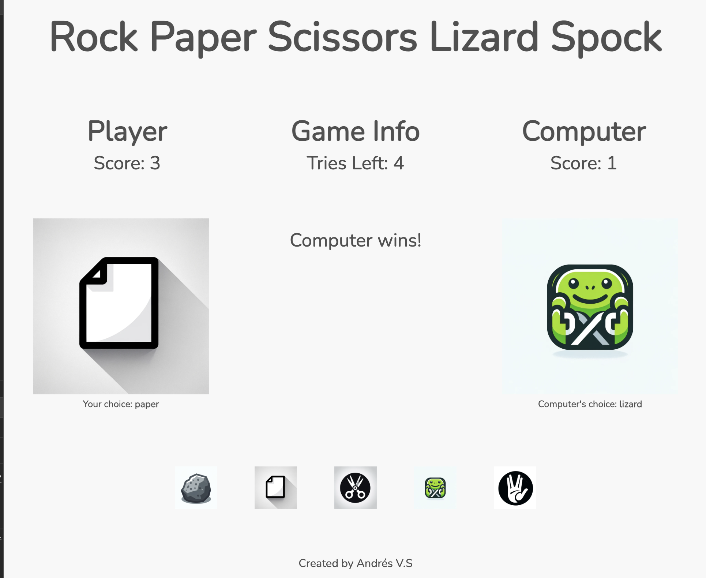
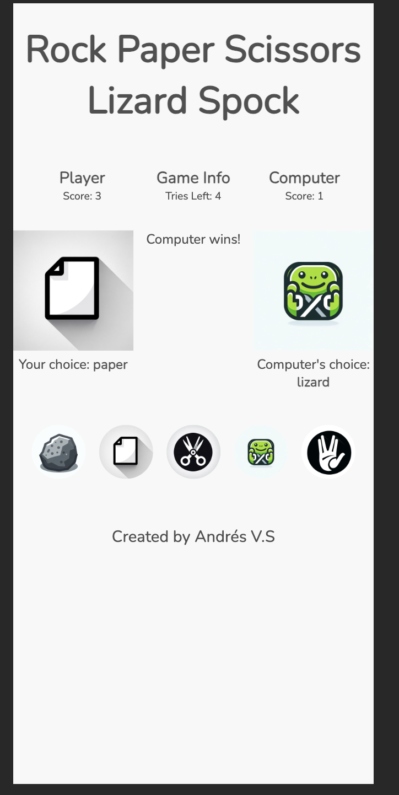
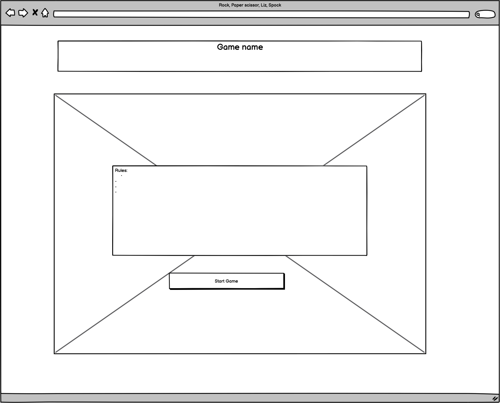
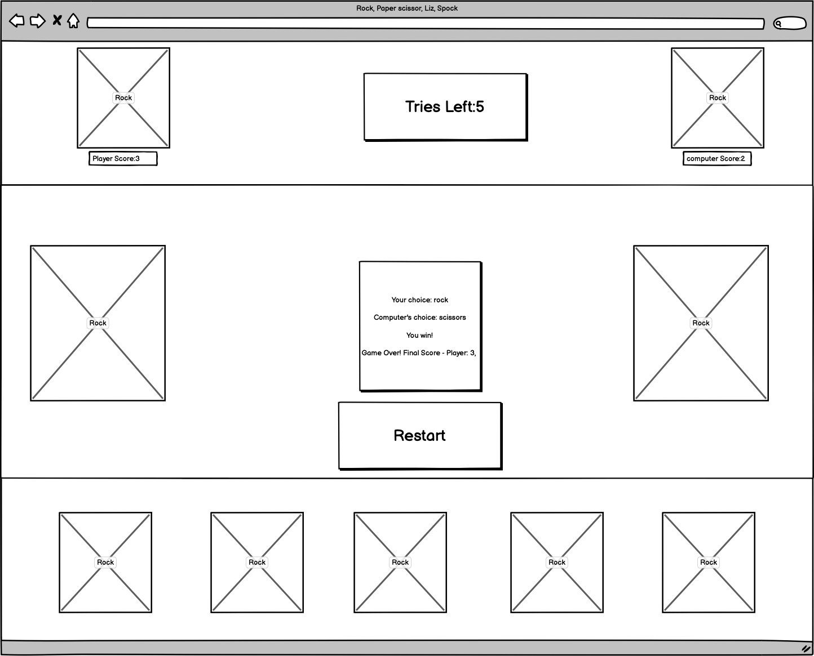
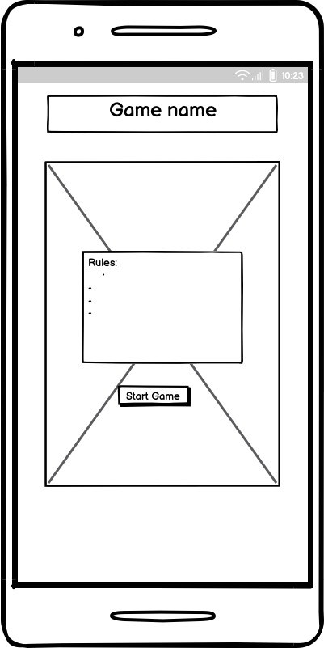
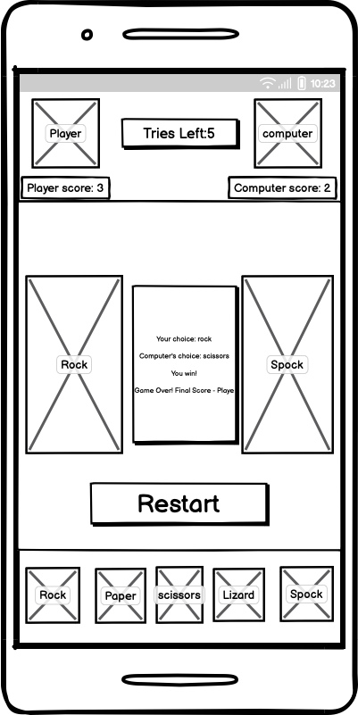

# Rock, Paper, Scissors, Lizard, Spock Game

This project is a web-based implementation of the popular game "Rock, Paper, Scissors, Lizard, Spock". It's an extended version of the classic Rock Paper Scissors game, adding two more choices - Lizard and Spock, making the game more interesting and less predictable.

 

 

 

 


## Table of Contents

1. [Demo](#demo)
2. [Technologies Used](#technologies-used)
3. [Game rules](#game-rules)
5. [How to play](#how-to-play)
6. [File Structure](#file-structure)
7. [Setup](#setup)
8. [Features](#features)
9. [Sources](#sources)
10. [Contact](#contact)

## Demo

The live demo of the game is in progress. https://thebluewolfofthenorth.github.io/Rock-Paper-Scissors-Lizard-Spock_Game/

## Technologies Used

- HTML5: For structuring the game content.
- CSS3: For styling, including responsive design features.
- Utilizes the Nunito font from Google Fonts.
- JavaScript: To create interactive elements, handle game logic, and update the DOM based on game progress.
- VS Code
- Adobe photoshop: to create game icons

## Game rules

- Rock crushes Scissors and Lizard.
- Paper covers Rock and disproves Spock.
- Scissors cuts Paper and decapitates Lizard.
- Lizard poisons Spock and eats Paper.
- Spock smashes Scissors and vaporizes Rock.

## How to Play

- Visit the game page.
- Choose between Rock, Paper, Scissors, Lizard, and Spock by clicking on the respective buttons.
- The computer makes its choice, and the result is displayed.
- The game tracks the number of tries left and updates the scores after each round.
- When all tries are exhausted, the game ends, showing the final score.


## File Structures
```plaintext
Rock-Paper-Scissors-Lizard-Spock/
│
├── assets/
│   ├── css/
│   │   └── style.css
│   ├── js/
│   │   └── script.js
│   └── images/
│       ├── element/
│       │   ├── rock.png
│       │   ├── paper.png
│       │   ├── scissors.png
│       │   ├── lizard.png
│       │   └── spock.png
│       └── thebigbangtheory.png
│
├── game.html
├── index.html
└── README.md
```


## Site Structure

The game is structured to provide an interactive user experience:

- **Front Page (index.html)**: 
- Introduction and Rules: Introduces the game and explains the rules. 
- Navigation: Includes a link or button to navigate to the main game page (game.html).
- **Game Page (game.html)**: 
- User Interface: Presents the choice buttons (Rock, Paper, etc.), the scoreboard, and the number of remaining tries.
- Game Interactivity: Users interact with the game by clicking on the choice buttons.
- Scoreboard and Tries: Displays the current scores and the number of tries left.
- Result Display: Shows the user's and computer’s choices and the result of each round.
- **JavaScript Logic (script.js)**: 
- Event Listeners: Listens for user interactions (clicks) and executes game logic accordingly.
- Game Mechanics: Randomly generates the computer's choice, compares it with the user's choice, and determines the winner.
- DOM Manipulation: Updates the web page content based on game progress, including scores, tries left, and round results.
- **Styling (style.css)**: 
- Visual Presentation: Styles the HTML elements for a pleasing and user-friendly interface.
- Responsiveness: Ensures the game is playable and looks good on various devices, from mobile phones to desktop computers.

## Typography
In this game, we have chosen to use the 'Nunito' font, sourced from Google Fonts. Nunito is a well-balanced, sans-serif typeface that features rounded terminals, giving it a warm and friendly feel while maintaining a high level of readability. This font was selected for several reasons:


- **Readability**: The clarity of Nunito, especially on digital screens, makes it an excellent choice for game interfaces where readability is paramount. This is crucial in our game, as players need to quickly and easily read the game's rules, score, and choices.

- **Font Import**: `@import url(('https://fonts.googleapis.com/css2?family=Nunito&display=swap');`

- **Aesthetic Appeal**: Nunito offers a modern and sleek look that complements the game's minimalist design. Its rounded characteristics add a touch of softness and approachability, enhancing the overall aesthetic without being overly ornate.

- **Consistency Across Devices**: As a web-based game, ensuring that the typography looks consistent across different devices and browsers is essential. Nunito, being a widely supported and web-optimized font, maintains the game's visual integrity across various platforms.


## Color Scheme

The color scheme for the Rock, Paper, Scissors, Lizard, Spock game is carefully chosen to enhance the user experience while maintaining a clean, modern aesthetic. The palette consists of a range of greys complemented by a subtle off-white background, creating a minimalist yet inviting visual appeal. Here are the specifics:

- **Subtle Off-White Background** `#F8F8F8`: The primary background color is a soft off-white, providing a neutral and calming backdrop. This choice helps in reducing visual strain and ensuring that the game elements are the focal point.

Monochrome Shades for Interactivity:

- **Light Grey** `#E0E0E0`: Used for less interactive elements, offering a gentle contrast against the background.
- **Medium Greys** `#C0C0C0, #A0A0A0`: These shades are utilized for interactive elements like buttons. The medium contrast makes them stand out and invites interaction, without being overwhelming.
- **Darker Grey** `#808080` and Darkest Grey `#505050`: Employed for important texts and elements that require more emphasis, ensuring they are easily noticeable and readable.
- **Purposeful Contrast**: The chosen shades are designed to provide optimal contrast against each other and the background. This not only adds to the visual appeal but also ensures that the game is accessible to players with varying visual capabilities.

- **Consistency and Focus**: The use of a monochrome palette keeps the focus on the gameplay. The consistent use of grey shades across different elements provides a cohesive and harmonious visual experience, which is particularly important in a game where player focus is key.

This color scheme aligns with the game's overarching design philosophy of creating a straightforward yet engaging user interface. It supports the game's usability while contributing to an aesthetically pleasing environment that players can enjoy.


### Wireframes:

The wireframes for PUST  [Balsamiq]("https://balsamiq.cloud/"). There are frames for a full width display and a small mobile device. The final site varies slightly.











## Features
The website incorporates several features to provide a user-friendly experience:

- **Responsive Design**: The website layout adjusts to various screen sizes, ensuring a pleasant user experience on both desktop and mobile devices.
- **Interactive Techniques Section**: The techniques section on the Techniques page presents various yoga and mindfulness exercises, each with a descriptive image and text.
- **Sign-up Form**: The Sign-up page features a form for interested visitors to join the center or request more information.
- **Accessible Navigation**: The navigation menu allows users to easily navigate through the website and find the information they need.

Interactive Gameplay: Users can play Rock, Paper, Scissors, Lizard, Spock against a computer-generated choice.
Score Tracking: The game keeps track of the player's and computer's scores.
Limited Tries: The game limits the number of tries in each session.
Responsive Design: Optimized for various devices, ensuring a seamless experience on both mobile and desktop screens.


## Navigation Menu
Game Setup and Mechanics
- **Two-Page Layout**: The game consists of two main pages - a front page (index.html) that introduces the game and its rules, and a game page (game.html) where the actual gameplay takes place.
- **Responsive Design**: Designed to be fully responsive, the game provides an optimal user experience across various devices and screen sizes, from mobile phones to desktop computers.

Gameplay Features
- **Play against the Computer**: Engage in a match of Rock, Paper, Scissors, Lizard, Spock against a computer opponent with randomized choices.
- **Score Tracking**: Scores are tracked and displayed for both the player and the computer, updating in real-time as the game progresses.
- **Limited Tries**: The game sets a limit on the number of tries or rounds, adding a layer of challenge and strategy to the gameplay.
- **Dynamic Results Display**: After each round, the choices made by both the player and the computer, along with the round's result, are displayed dynamically.
- **Restart Capability**: Players have the option to restart the game once all tries are exhausted, allowing for continuous play and engagement.

Additional Features
- **Visual Feedback**: The game provides immediate visual feedback for each action, enhancing the interactivity and user engagement.
- **Accessible Design**: With a focus on accessibility, the game features high-contrast colors and large, easily clickable buttons, making it user-friendly for a wide range of players.
- **In-Depth Rule Explanation**: The front page offers a detailed explanation of the rules, ensuring that players understand the extended version of the classic Rock Paper Scissors game.


## Testing

Please refer to <a href="https://github.com/thebluewolfofthenorth/yoga-mindfullnes-app"><em>here<em></a> for more information on testing PUST-Yoga-and-mindfullnes

## Deployment 

This site was depolyed to GitHub pages. The steps to deploy a site are shown below:

1. In the GitHub Repository called <b>yoga-mindfullnes-app</b> click on the <b>Settings</b> button on the Repoitory navigation menu.

2. In <b>Settings</b> on the left side, go down to the <b>Pages</b> item and click on it.

3. Make sure the <b>Source</b> item is set to: <b>Deploy from a branch</b>

4. at the <b>Branch</b> item underneth the <b>source</b> item, set the branch to main and save it.

5. Once you have selected the main branch, the page will automatically refresh to show a detailed ribbon display indicating that the deployment was successful.

To get to the live link of the GitHub repository - click here: <a href="https://thebluewolfofthenorth.github.io/yoga-mindfullnes-app/">https://thebluewolfofthenorth.github.io/Rock-Paper-Scissors-Lizard-Spock_Game/
</a>


#### To create a local clone of this project:

1. Click the Code tab under the repository's name.
2. Click the clipboard icon in the Clone with HTTPS section to copy the URL.


Once you have copied the URL, you can use a Git client to clone the repository to your local computer.
Here are the steps to clone a repository using Git Bash:

3. Open Git Bash.
4. Navigate to the directory where you want to clone the repository.
5. Type the following command and press Enter:

git clone <URL>

Replace <URL> with the URL of the repository that you copied in step 2.

This will create a local clone of the repository in the current directory.

You also can create and name the directory where the clone should be saved in, with adding the directory name after the <URL>. So the full command would look like this: git clone <URl> XXXX(This is a directory name)


   ### Media:

 - my img where also self-made using adobe photoshop to create simple img for the game elements

  - background pictures was taking from the internet. 
 https://www.deviantart.com/mstrange221b/art/The-Big-Bang-Theory-Folder-icon-889259486


   ### Code: 

 - all my code was self made with some base ideas taking from https://www.w3schools.com/ but nothing was taking from there

   ## Acknowledgements:

   thanks to my mentor Ronan to help me along to the completion of this project

   - I chose to build a simple game with the intention of keeping it straightforward and saving time to incorporate more dynamics and animations. However, this didn't quite work out as planned. I encountered minor issues, like z-index problems, which caused significant challenges and took a long time to diagnose and resolve. In the end, I was quite satisfied with the game's functionality, especially the JavaScript aspects. The design could have been better, but with more time and if this were a full-time job, I believe I could have created something truly impressive.


## note:

- I spend a lot of time learning about simple structure ideas not covered in the course, requiring extensive reading from w3schools on the basics. All of my code is self-created. It was disappointing to see my game fail the Lighthouse test on desktop due to several issues I wasn't aware of. It's possible to fix these, but I'll need more time to work on it and to further my understanding of the underlying concepts.