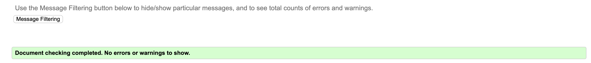
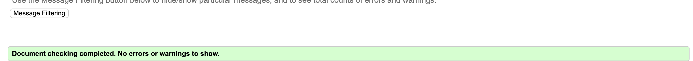
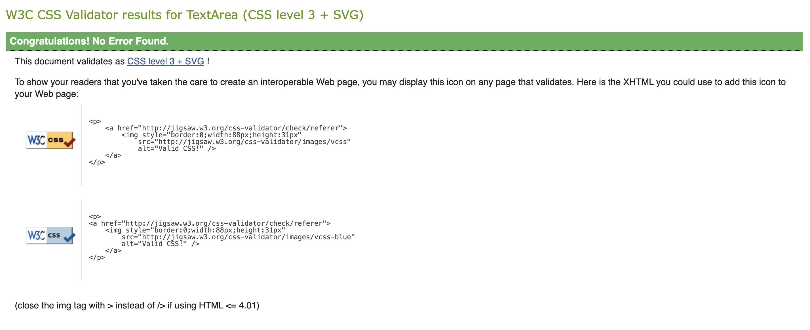
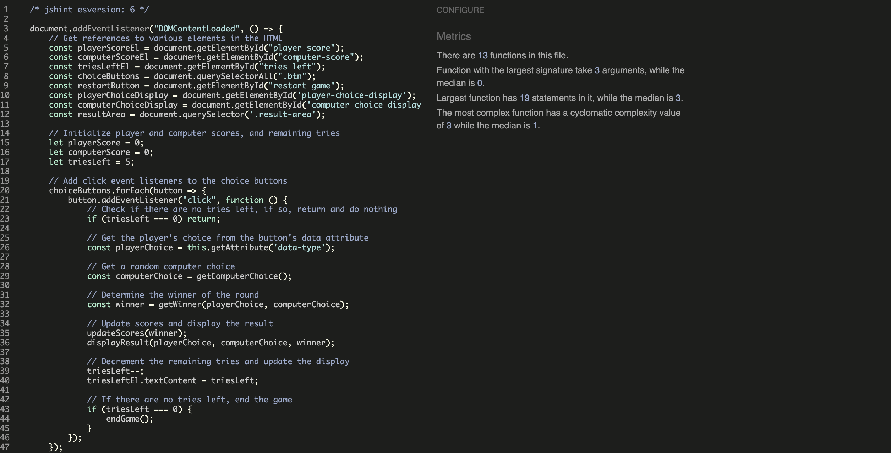
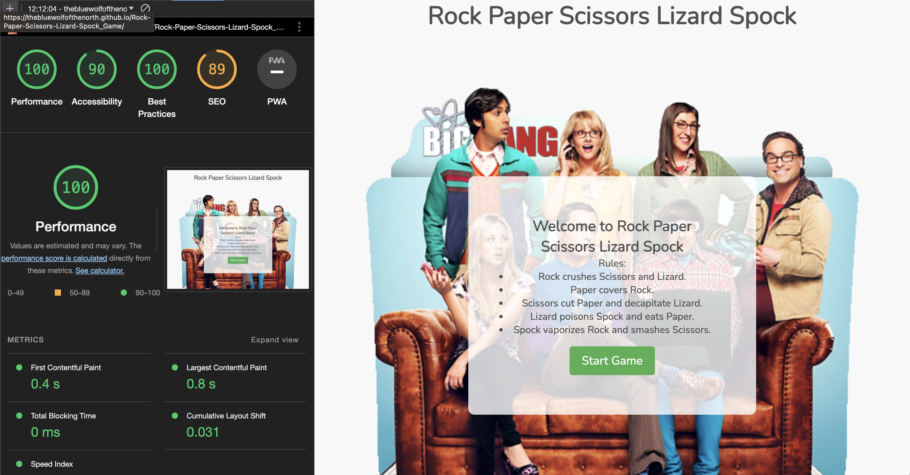
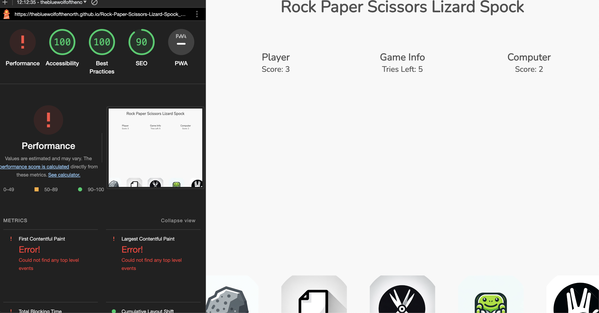
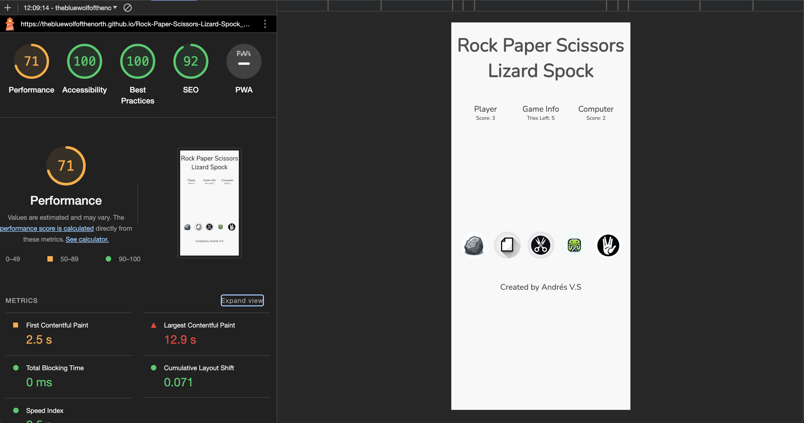

# Testing

## Code Validation

- Rock Paper Scissors Lizard and Spock Game has been thoroughly tested. All of the code has been run through the W3C HTML Validator, the W3C CSS Validator and the JSHINT.  no errors were found.

The HTML validator results for each page are below:

 - Front:

 

 - Game:

 

 -

 - CSS stylesheet - CSS Validator result:

 

 - JS stylesheet - JS Validator result:

 

 ## Responsivness Test
 The responsive design tests were carried out manually with <a href="https://developer.chrome.com/docs/devtools/">Google Chrome DevTools</a> and <a href="https://www.responsivedesignchecker.com/">Responsive Design Checker</a> and <a href="https://www.mozilla.org/en-US/firefox/developer/">Firefox DevTools</a>

 The site passed most Test on the <a href="https://www.responsivedesignchecker.com/">Responsive Design Checker.</a>

   Note: Playing this game on the iPhone SE, iPhone 3/4/4s/5/5s is not optimal, as the game is not developed for older phones and doesn't take them into consideration. These models have a minimal impact on markets like EMEA. Additionally, there have been some issues with certain tablets, but due to their low usage in the market, they are not a priority.
 

 ### Lighthouse

 The site was also tested using <a href="https://developer.chrome.com/docs/lighthouse/overview/#devtools">Lighthouse</a> in Chrome Developer Tools to test each of the pages for: 

  - Performance - How the page performs whilst
  loading.
  - Accessibility - Is the site acccessible for all users and how can it be improved
  - Best Practices - Site conforms to industry
  best practices.
  - SEO - Search engine optimisation. Is the site optimised for search engine result rankings.

The Screenshot below show the result for Desktops: 

The Screenshot below show the result for small devices like mobiles:

note: Lighthouse Performance Optimizations
During testing with Lighthouse, an issue was identified: "Eliminate render-blocking resources Error". This issue pertains to JavaScript and CSS files that hinder the initial rendering of the page. Initially, I wasn't aware of the significance of this problem, nor did I possess the required knowledge to tackle it effectively.

From my understanding, based on the course's best practices, the code was structured properly. However, further reading and insights from Lighthouse suggested that numerous optimizations could be implemented. These include inlining critical CSS, deferring non-critical JavaScript and CSS, optimizing file sizes, and more. 

This revelation was quite a surprise, especially since the code had been reviewed by a mentor who found it to be satisfactory. It underscores the importance of continuous learning and improvement in web development.

Currently, due to time constraints and the complexity involved in these optimizations, I have not been able to implement these changes. However, I plan to address these issues in future updates to improve the site's performance and adhere to modern web development standards.

